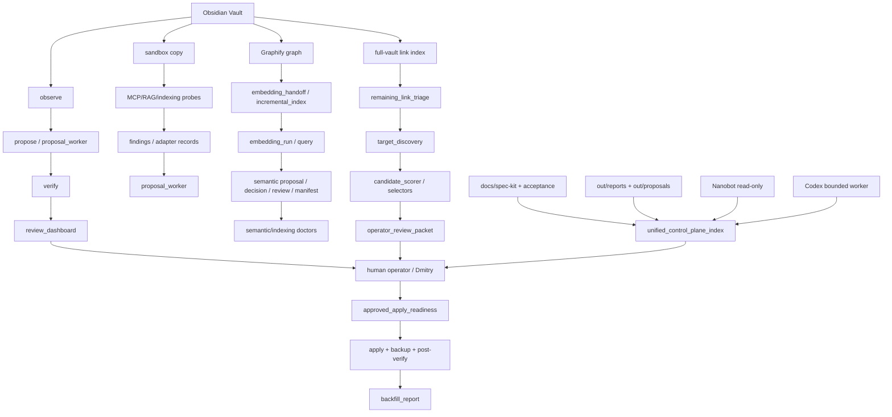

# Obsidian Operating Layer — full tooling audit / полный аудит инструментов

**Date / дата:** 2026-07-08
**Repo / репозиторий:** `/home/hermesadmin/work/obsidian-operating-layer`
**Scope / охват:** source-controlled project tooling, CLI wrappers, core `src/obslayer` modules, specs, acceptance docs, tests, and repo-local generated evidence indexes. Live Obsidian vault mutation was not performed.

## Executive summary / краткий вывод

### RU
Проект — это безопасный слой управления Obsidian vault: сначала наблюдает и индексирует, затем формирует proposal-only evidence, затем сужает кандидатов для review, и только после отдельного approval manifest может выполнять live apply. Основная архитектура уже зрелая: инструменты разделены по фазам `observe → propose → verify/review → readiness → apply`, а новые индексаторы/Graphify/semantic/Nanobot/Codex поверхности остаются repo-only или proposal-only.

### EN
The project is a safety-first control layer for an Obsidian vault: it observes and indexes first, produces proposal-only evidence, narrows candidates for operator review, and allows live apply only through a separate explicit approval manifest. The architecture is already mature: tools are separated into `observe → propose → verify/review → readiness → apply`, while newer indexing/Graphify/semantic/Nanobot/Codex surfaces remain repo-only or proposal-only.

## Audit facts / факты аудита

| Metric | Value |
|---|---:|
| CLI tools under `tools/` | 55 |
| Core Python modules under `src/obslayer/` | 46 |
| Test files | 62 |
| Static test functions counted | 419 |
| Full test run | `python3 -m pytest -q` passed |
| Docs-lag audit | passed: no findings |
| Unified control-plane generation | passed: 9 canonical docs, 20 evidence artifacts, 12 worker signals, 1 next action |

## Safety model / модель безопасности

| Boundary | RU | EN |
|---|---|---|
| `observe` | Только чтение vault, без правки файлов. | Read-only vault inspection, no file edits. |
| `propose` | Создаёт dry-run/proposal bundles, но не меняет vault. | Creates dry-run/proposal bundles, does not mutate the vault. |
| `verify` / `doctor` | Проверяет консистентность, safety flags, manifest/artifact completeness. | Checks consistency, safety flags, manifest/artifact completeness. |
| `review` / `selector` | Сужает шум до review candidates; не выдаёт apply authority. | Narrows noise into review candidates; does not grant apply authority. |
| `readiness` | Проверяет exact binding proposal ↔ manifest ↔ targets ↔ hashes. | Checks exact proposal ↔ manifest ↔ targets ↔ hashes binding. |
| `apply` | Live write только после явного approval manifest, backup и post-verify. | Live write only after explicit approval manifest, backup, and post-verify. |
| protected paths | `.obsidian`, `_Backups`, `_Archive`, `.trash`, Soul/cross-vault surfaces не автоправятся. | `.obsidian`, `_Backups`, `_Archive`, `.trash`, Soul/cross-vault surfaces are not auto-mutated. |

## Canonical invocation sequences / канонические последовательности вызова

### 1. Human-safe live-vault analysis / безопасный анализ live vault

```text
obsidian_observe.py
  → obsidian_propose.py or obsidian_proposal_worker.py
  → obsidian_verify.py
  → obsidian_review_dashboard.py list/explain
  → human review
  → obsidian_approved_apply_readiness.py [only if approval manifest exists]
  → obsidian_apply.py --apply [only after explicit approval]
  → post-verify + obsidian_backfill_report.py
```

RU: это основной путь от чтения vault до потенциальной правки. До `approved_apply_readiness` и explicit approval всё остаётся dry-run/proposal-only.  
EN: this is the main path from vault inspection to a possible edit. Until `approved_apply_readiness` and explicit approval, everything remains dry-run/proposal-only.

### 2. Sandbox/component evaluation / проверка готовых компонентов в sandbox

```text
obsidian_sandbox.py
  → obsidian_mcp_adapter.py / obsidian_rag_graph_adapter.py / obsidian_indexing_stdio_probe.py
  → obsidian_diagram_pdf_report.py [optional reporting]
  → obsidian_review_dashboard.py / acceptance docs
```

RU: внешний компонент сначала запускается только на sandbox-copy и отдаёт findings/evidence. Он не получает live write ownership.  
EN: external components run against a sandbox copy first and only return findings/evidence. They do not receive live write ownership.

### 3. Graphify / semantic indexing lane / Graphify-семантический контур

```text
obsidian_resource_preflight.py
  → obsidian_graphify_embedding_handoff.py
  → obsidian_graphify_embedding_run.py [bounded, optional]
  → obsidian_graphify_embedding_query.py
  → obsidian_semantic_proposal_report.py
  → obsidian_semantic_candidate_decision_packet.py
  → obsidian_semantic_targeted_proposal.py
  → obsidian_semantic_review_index.py
  → obsidian_semantic_manifest.py
  → obsidian_semantic_manifest_doctor.py / obsidian_indexing_doctor.py
```

RU: semantic/embedding слой даёт evidence и candidates, но не является authority для edits. `obsidian_graphify_incremental_index.py` объединяет часть этого пути как dry-run-first wrapper и пишет только под repo `out/`.  
EN: the semantic/embedding layer produces evidence and candidates, but is not edit authority. `obsidian_graphify_incremental_index.py` wraps part of this path as a dry-run-first wrapper and writes only under repo `out/`.

### 4. Full-vault link hygiene / разбор ссылок всего vault

```text
full-vault index artifacts
  → obsidian_remaining_link_triage.py
  → obsidian_remaining_link_target_discovery.py
  → obsidian_lane_schema_v1.py
  → obsidian_archive_shadow_index.py
  → obsidian_candidate_scorer.py
  → obsidian_manual_review_selector.py / obsidian_safe_auto_proposal_thresholds.py
  → obsidian_operator_review_packet.py
  → obsidian_approved_apply_readiness.py [only with approval manifest]
  → obsidian_apply.py [only explicit live apply]
```

RU: этот контур решает broken/ambiguous wikilinks, архивные коллизии и шум. Большая часть результата — review evidence, не автоматическая правка.  
EN: this lane handles broken/ambiguous wikilinks, archive collisions, and noise. Most outputs are review evidence, not automatic edits.

### 5. Operator/control-plane / операторский control plane

```text
obsidian_project_docs_lag_audit.py
  → obsidian_unified_operator_review_index.py
  → obsidian_candidate_volume_operator_packet.py
  → obsidian_acceptance_bundle_doctor.py
  → obsidian_unified_control_plane_index.py
  → docs/acceptance + docs/spec-kit + docs/triage mirrors
```

RU: это слой для Hermes/оператора: какие evidence актуальны, что stale, что готово к review, где blockers, и что можно передать Codex/Nanobot.  
EN: this is the Hermes/operator layer: which evidence is current, stale, ready for review, blocked, and safe to dispatch to Codex/Nanobot.

### 6. Agent collaboration / взаимодействие агентов

```text
nanobot_readonly_evidence_gateway.py
  → nanobot_review_packet.py
  → codex_hermes_comm.py / hermes_codex_run.py
  → Hermes verification
  → acceptance docs / operator reports
```

RU: Nanobot и Codex — advisory/worker surfaces. Они не получают прямого права live mutation; Hermes остаётся acceptance/safety owner.  
EN: Nanobot and Codex are advisory/worker surfaces. They do not receive direct live mutation authority; Hermes remains acceptance/safety owner.

## CLI tool inventory / инвентарь CLI-инструментов

| Tool | RU: что делает | EN: what it does | Main inputs / основные входы | Core module |
|---|---|---|---|---|
| `tools/codex_hermes_comm.py` | Канал задач/отчётов/ACK между Codex и Hermes для ограниченной делегации. | Codex↔Hermes task/report/ACK channel for bounded delegated work. | `--id, --type, --scope, --instructions, --review-only, --id, --task-id, --status, …` | — |
| `tools/hermes_codex_run.py` | Обёртка запуска Codex с repo/policy-снимками и фиксацией дельт/отчётов. | Wrapper that runs Codex under repo/policy snapshots and captures deltas/reports. | `--repo, --mode, --task, --profile, --dry-run, --sandbox, --codex-timeout-seconds, --allow-danger-full-access` | — |
| `tools/nanobot_readonly_evidence_gateway.py` | Запускает read-only evidence gateway для Nanobot. | Starts the read-only evidence gateway for Nanobot. | — | `obslayer.nanobot_readonly_evidence_gateway` |
| `tools/nanobot_review_packet.py` | Собирает компактный пакет ревью из repo-local evidence для Nanobot/Hermes. | Builds a compact review packet from repo-local evidence for Nanobot/Hermes review. | `--repo, --slice, --out, --gateway, --file, --note` | — |
| `tools/obsidian_acceptance_bundle_doctor.py` | Проверяет acceptance bundle completeness и safety flags. | Validates acceptance bundle completeness and safety flags. | `--bundle, --repo, --out-dir, --json-only` | `obslayer.acceptance_bundle_doctor` |
| `tools/obsidian_apply.py` | По умолчанию dry-run; live apply только с явным approval manifest. | Dry-run by default; live apply only with explicit approval manifest. | `--proposal, --approval-manifest, --apply, --out` | `obslayer` |
| `tools/obsidian_approved_apply_readiness.py` | Проверяет безопасную связку proposal + approval manifest по hash/target. | Checks that proposal + approval manifest are safely hash/target bound. | `--proposal, --approval-manifest, --out-dir, --json-only` | `obslayer`, `obslayer.approved_apply_readiness_v1` |
| `tools/obsidian_archive_shadow_index.py` | Классифицирует archive/backup/duplicate/redirect shadows как evidence-only. | Classifies archive/backup/duplicate/redirect shadows as evidence-only. | `--notes-index-jsonl, --out-dir` | `obslayer.archive_shadow_index` |
| `tools/obsidian_backfill_report.py` | Пишет operator report в Obsidian Reports после proposal/apply работы. | Writes an operator report into Obsidian Reports after proposal/apply work. | `--proposal, --reports-dir, --out` | `obslayer` |
| `tools/obsidian_candidate_scorer.py` | Оценивает candidate packets с reason codes и review bands. | Scores link/candidate packets with reason codes and review bands. | `--actionable-lanes-json, --notes-index-jsonl, --wikilinks-jsonl, --out-dir, --lane, --packet-id, --limit, --suppression-triage-json` | `obslayer.candidate_scorer_v1` |
| `tools/obsidian_candidate_volume_operator_packet.py` | Отчитывает candidate/protected volume и route buckets. | Reports candidate/protected volume and route buckets. | `--repo, --observation, --proposal, --verify, --unified-index, --out-dir, --json-only` | `obslayer.candidate_volume_operator_packet`, `obslayer.guardrails` |
| `tools/obsidian_channel_registry_verify.py` | Проверяет channel registry shape/safety. | Validates configured channel registry shape/safety. | `--registry, --out-dir` | `obslayer.channel_registry` |
| `tools/obsidian_controlled_autonomy.py` | Ручные queue jobs observe/index/report; без права устанавливать scheduler. | Manual queue jobs for observe/index/report acceptance; no scheduler authority. | `--queue-root, --kind, --vault, --task-id, --schedule-label, --priority, --task-id, --older-than-seconds, …` | `obslayer` |
| `tools/obsidian_diagram_pdf_report.py` | Генерирует diagram/PDF report artifacts из adapter records. | Renders diagram/PDF report artifacts from adapter records. | `--adapter-record, --project-root, --diagram-out-dir, --report-out-dir` | `obslayer` |
| `tools/obsidian_external_tool_benchmark.py` | Read-only deterministic comparison сигналов external tools. | Read-only deterministic comparison of external-tool findings/signals. | `--scored-packets, --out-dir, --benchmark-id` | `obslayer.external_tool_benchmark` |
| `tools/obsidian_field_slice.py` | End-to-end proposal-only slice для полевой acceptance-проверки. | End-to-end proposal-only field acceptance slice. | `--vault, --out-root, --task-id, --decision, --reason` | `obslayer` |
| `tools/obsidian_graphify_embedding_handoff.py` | Преобразует Graphify graph output в bounded embedding manifest candidates. | Converts Graphify graph output into bounded embedding manifest candidates. | `--graph-json, --sandbox-vault, --out-dir, --derived-root, --max-candidates` | `obslayer`, `obslayer.graphify_embedding_handoff` |
| `tools/obsidian_graphify_embedding_query.py` | Запускает semantic query smoke по embedding artifacts. | Runs semantic query smoke over embedding run artifacts. | `--run-json, --out-dir, --query, --top-k, --provider, --dimensions, --ollama-base-url, --ollama-model, …` | `obslayer`, `obslayer.graphify_embedding_query` |
| `tools/obsidian_graphify_embedding_run.py` | Запускает bounded embeddings из manifest в derived artifacts. | Runs bounded embeddings from a manifest into derived artifacts. | `--manifest, --out-dir, --derived-root, --max-files, --provider, --allow-smoke-provider, --ollama-base-url, --ollama-model, …` | `obslayer`, `obslayer.graphify_embedding_runner` |
| `tools/obsidian_graphify_incremental_index.py` | Dry-run-first wrapper для Graphify handoff, delta embedding selection, optional run/query smoke. | Dry-run-first wrapper for Graphify handoff, delta embedding selection, optional run/query smoke. | `--graph-json, --sandbox-vault, --out-dir, --derived-root, --max-candidates, --max-delta-candidates, --provider, --allow-smoke-provider, …` | `obslayer`, `obslayer.graphify_incremental_index` |
| `tools/obsidian_indexing_doctor.py` | Проверяет indexing manifest/artifacts contract. | Validates indexing manifest/artifacts contract. | `--require-artifact, --artifact-base, --out` | `obslayer.indexing_manifest_doctor` |
| `tools/obsidian_indexing_runtime.py` | Guarded indexing runtime по sandbox vaults и derived outputs. | Guarded indexing wrapper/runtime over sandbox vaults and derived outputs. | `--sandbox-vault, --derived-root, --raw-transcript, --auto-probe-sample, --sample-query, --raw-report, --sanitized-report, --report-root, …` | `obslayer`, `obslayer.indexing_wrapper` |
| `tools/obsidian_indexing_spike.py` | Небольшой indexing spike по candidate records. | Small indexing experiment over candidate records. | `--candidate-record, --sandbox-vault, --out-dir, --query` | `obslayer` |
| `tools/obsidian_indexing_stdio_probe.py` | Stdio probe внешних indexers; dry-run если не разрешены derived writes. | Stdio probe for external indexers, dry-run unless derived writes allowed. | `--sandbox-vault, --derived-root, --raw-report, --sanitized-report, --report-root, --command, --query, --index-mode, …` | `obslayer`, `obslayer.indexing_wrapper` |
| `tools/obsidian_lane_schema_v1.py` | Конвертирует actionable lanes в versioned lane packets. | Converts actionable lanes into versioned lane packets. | `--actionable-lanes-json, --notes-index-jsonl, --wikilinks-jsonl, --out-dir, --packet-id` | `obslayer.lane_schema_v1` |
| `tools/obsidian_llm_channel_smoke.py` | Smoke-test LLM channel registry; live только по явному флагу. | Smoke-tests LLM channel registry, live only when explicitly requested. | `--registry, --out-dir, --live-probes` | `obslayer.llm_channel_smoke` |
| `tools/obsidian_manifest_candidate_selector.py` | Выбирает bounded candidates из manifests/operator evidence. | Selects at most bounded candidates from existing manifests/operator evidence. | `--repo, --candidate-packet, --unified-index, --operator-review-packet, --out-dir, --max-candidates, --json-only` | `obslayer.guardrails`, `obslayer.manifest_candidate_selector` |
| `tools/obsidian_manual_review_selector.py` | Сужает proposals до bounded manual review candidates. | Narrows proposals into bounded manual review candidates. | `--proposal-json, --out-dir, --max-candidates` | `obslayer.manual_review_selector_v1` |
| `tools/obsidian_mcp_adapter.py` | Sandbox/read-only probe для MCP adapter. | Sandbox/read-only MCP adapter probe. | `--adapter-record, --sandbox-vault, --out-dir, --probe-tool` | `obslayer` |
| `tools/obsidian_observe.py` | Read-only сканер vault; создаёт observation JSON. | Read-only vault scanner; produces observation JSON. | `--vault, --out` | `obslayer` |
| `tools/obsidian_operator_decision_ledger.py` | Append-only weak-evidence ledger операторских решений. | Append-only weak-evidence ledger of operator decisions. | `--records, --out-dir, --ledger-id, --created-at, --decision-id, --decision-type, --actor, --reason, …` | `obslayer.operator_decision_ledger_v1` |
| `tools/obsidian_operator_review_packet.py` | Собирает компактный operator review packet из proposal/readiness evidence. | Builds compact operator review packet from proposal/readiness evidence. | `--repo, --proposal-packet, --readiness-packet, --max-review-items, --out-dir` | `obslayer.operator_review_packet` |
| `tools/obsidian_operator_review_queue.py` | Собирает current operator review queue из repo artifacts. | Builds current operator review queue from repo artifacts. | `--repo-root, --out-dir` | `obslayer.operator_review_queue` |
| `tools/obsidian_project_docs_lag_audit.py` | Проверяет, что accepted capabilities отражены в specs/acceptance. | Checks that known accepted capabilities are documented in specs/acceptance. | `--repo, --out-dir` | `obslayer.project_docs_lag_audit` |
| `tools/obsidian_proposal_worker.py` | Нормализует findings от компонентов во внутренний безопасный proposal bundle. | Normalizes external/component findings into safe proposal bundles. | `--findings, --vault-root, --out-dir, --source-id` | `obslayer` |
| `tools/obsidian_propose.py` | Превращает observation в dry-run proposal bundle. | Turns an observation into a dry-run proposal bundle. | `--observe, --out-dir` | `obslayer` |
| `tools/obsidian_rag_graph_adapter.py` | Sandbox/read-only probe для RAG/graph adapter. | Sandbox/read-only RAG/graph adapter probe. | `--adapter-record, --sandbox-vault, --out-dir, --query, --exclude-source-prefix` | `obslayer` |
| `tools/obsidian_remaining_link_target_discovery.py` | Ищет proposal-only target candidates для triaged remaining links. | Finds proposal-only target candidates for triaged remaining links. | `--triage-json, --notes-index-jsonl, --out-dir, --min-confidence` | `obslayer.remaining_link_target_discovery` |
| `tools/obsidian_remaining_link_triage.py` | Классифицирует unresolved wikilinks в protected/generated/manual/suppressed buckets. | Classifies unresolved wikilinks into protected/generated/manual/suppressed buckets. | `--wikilinks-jsonl, --out-dir` | `obslayer.remaining_link_triage` |
| `tools/obsidian_resource_preflight.py` | Проверяет RAM/swap/load перед тяжёлой локальной indexing/embedding работой. | Checks RAM/swap/load before heavy local indexing/embedding work. | `--min-available-mb, --max-swap-used-mb, --max-load-per-cpu, --max-swap-io-pages-per-sec, --sample-seconds` | `obslayer`, `obslayer.resource_preflight` |
| `tools/obsidian_review_dashboard.py` | Показывает/объясняет pending dry-run proposals и проверяет dashboard source. | Lists/explains pending dry-run proposals and validates dashboard source. | `--proposal-root, --json, --out, --proposal, --json, --out, --dashboard, --json, …` | `obslayer` |
| `tools/obsidian_safe_auto_proposal_thresholds.py` | Создаёт dry-run proposal candidates только из high-confidence scored packets. | Builds dry-run proposal candidates from high-confidence scored packets only. | `--candidate-scorer-json, --out-dir, --packet-id` | `obslayer.safe_auto_proposal_thresholds_v1` |
| `tools/obsidian_sandbox.py` | Создаёт/сбрасывает sandbox-копии vault без protected paths. | Creates or resets protected-path-excluding sandbox vault copies. | `--source-vault, --source, --sandbox-root, --name, --reset, --out` | `obslayer` |
| `tools/obsidian_semantic_candidate_decision_packet.py` | Собирает review/decision packet из semantic proposal candidates. | Builds review/decision packet from semantic proposal candidates. | `--semantic-proposal-json, --out-dir, --packet-id` | `obslayer`, `obslayer.semantic_candidate_decision_packet` |
| `tools/obsidian_semantic_manifest.py` | Финальный manifest по embedding/query/proposal/review artifacts. | Terminal manifest over embedding/query/proposal/review artifacts. | `--repo, --embedding-manifest, --embedding-run, --query-smoke, --semantic-proposal, --decision-packet, --targeted-proposal, --review-index, …` | `obslayer`, `obslayer.semantic_manifest` |
| `tools/obsidian_semantic_manifest_doctor.py` | Проверяет semantic manifest на safety/completeness. | Validates semantic manifest safety/completeness. | `--repo, --manifest` | `obslayer`, `obslayer.semantic_manifest` |
| `tools/obsidian_semantic_proposal_report.py` | Превращает query smoke в proposal-only semantic candidate reports. | Turns query smoke results into proposal-only semantic candidate reports. | `--query-smoke-json, --out-dir, --proposal-id, --max-candidates` | `obslayer`, `obslayer.semantic_proposal_report` |
| `tools/obsidian_semantic_review_index.py` | Собирает review index по targeted semantic proposals. | Builds review index over targeted semantic proposals. | `--targeted-proposal-json, --out-dir` | `obslayer.semantic_review_index` |
| `tools/obsidian_semantic_targeted_proposal.py` | Группирует semantic candidates в targeted proposal-only packets. | Groups approved semantic candidates into targeted proposal-only packets. | `--decision-packet-json, --out-dir, --group, --proposal-id` | `obslayer`, `obslayer.semantic_targeted_proposal` |
| `tools/obsidian_standing_safe_link_prefix_baseline.py` | Read-only baseline report для standing safe link-prefix candidates. | Read-only baseline report for standing safe link-prefix candidates. | `--vault, --scan-root, --out-dir` | `obslayer.standing_safe_link_prefix_baseline` |
| `tools/obsidian_standing_safe_link_prefix_policy.py` | Machine-check deterministic standing safe link-prefix policy. | Machine-checks deterministic standing safe link-prefix policy cases. | `--policy-file, --source-relpath, --link, --existing-target` | `obslayer.standing_safe_link_prefix_policy` |
| `tools/obsidian_swap_drain.py` | Operator helper для drain swap перед resource-sensitive задачами. | Operator helper to drain swap before resource-sensitive runs. | `--min-post-drain-available-mb, --no-drop-caches` | — |
| `tools/obsidian_unified_control_plane_index.py` | Агрегирует canonical docs, evidence artifacts, worker signals, next actions. | Aggregates canonical docs, evidence artifacts, worker signals, next actions. | `--repo, --out-dir, --artifact, --max-reports, --include-out-glob, --json-only, --strict` | `obslayer.guardrails`, `obslayer.unified_control_plane_index` |
| `tools/obsidian_unified_operator_review_index.py` | Агрегирует operator review evidence в один inert index. | Aggregates operator review evidence into one inert index. | `--repo, --out-dir, --artifact, --json-only` | `obslayer.unified_operator_review_index` |
| `tools/obsidian_verify.py` | Проверяет согласованность observation/proposal перед review/apply. | Checks observation/proposal consistency before review or apply. | `--observe, --proposal, --json-only` | `obslayer` |

## Core module map / карта основных модулей

| Module | Role / роль | Public surface / публичная поверхность | Test coverage pointer |
|---|---|---|---|
| `src/obslayer/acceptance_bundle_doctor.py` | acceptance bundle doctor | AcceptanceBundleArtifact, AcceptanceBundleCheck, AcceptanceBundleDoctorReport, _repo_root, _as_bool, _artifact_path_under_allowed_roots, _doctor_artifact, _doctor_check, doctor_acceptance_bundle | `tests/test_acceptance_bundle_doctor.py` |
| `src/obslayer/approved_apply_readiness_v1.py` | approved apply readiness v1 | ApplyReadinessTarget, ApplyReadinessReport, evaluate_approved_apply_readiness, load_and_evaluate_approved_apply_readiness, approved_apply_readiness_to_markdown, write_approved_apply_readiness_bundle, _proposal_target_relpaths, _target_relpath | `tests/test_approved_apply_readiness_v1.py` |
| `src/obslayer/archive_shadow_index.py` | archive shadow index | build_archive_shadow_index, write_archive_shadow_index, read_notes_index_jsonl, render_report, _entry_for_shadow, _active_path | `tests/test_archive_shadow_index.py` |
| `src/obslayer/candidate_scorer_v1.py` | candidate scorer v1 | score_candidate, build_candidate_scorer_packet, _suppression_index, _is_true_like, _apply_suppression_gate, _suppression_gate_summary | `tests/test_candidate_scorer_v1.py`, `tests/test_safe_auto_proposal_thresholds.py` |
| `src/obslayer/candidate_volume_operator_packet.py` | candidate volume operator packet | CandidateVolumeOperatorPacket, _repo_root, _repo_local_path, _load_object, _true_like, _authority_findings, _protected_bucket | `tests/test_candidate_volume_operator_packet.py` |
| `src/obslayer/channel_registry.py` | channel registry | ChannelRegistryValidation, load_channel_registry, validate_channel_registry, channel_registry_validation_to_markdown | `tests/test_channel_registry.py` |
| `src/obslayer/controlled_autonomy.py` | controlled autonomy | utc_now, isoformat_z, parse_utc_timestamp, controlled_queue_dirs, _status_path, _safe_task_id | — |
| `src/obslayer/diagram_pdf_adapter.py` | diagram pdf adapter | DiagramPdfReportEvaluation, load_diagram_renderer_record, _resolve_under_project, _is_under, _slug, _diagram_title, _safe_source_preview_svg | — |
| `src/obslayer/external_autograph_policy.py` | external autograph policy | load_external_autograph_policy, validate_external_autograph_policy, external_policy_source | `tests/test_manual_review_selector_v1.py` |
| `src/obslayer/external_tool_benchmark.py` | external tool benchmark | ExternalToolBenchmarkReport, build_external_tool_benchmark_report, external_tool_benchmark_to_markdown, write_external_tool_benchmark_report, _default_scored_packets, _reference_tools, _compare_tool_to_packet | `tests/test_external_tool_benchmark.py` |
| `src/obslayer/graphify_embedding_handoff.py` | graphify embedding handoff | GraphifyEmbeddingCandidate, GraphifyEmbeddingHandoff, _is_relative_to, _resolve_existing_or_parent, _require_not_live, _require_under, _safe_sandbox_vault, _safe_report_dir | — |
| `src/obslayer/graphify_embedding_query.py` | graphify embedding query | GraphifyEmbeddingQueryHit, GraphifyEmbeddingQueryResult, GraphifyEmbeddingQueryReport, _safe_run_json, _safe_query_report_dir, _cosine, _query_vector, _load_embedding_chunks, run_graphify_embedding_query_smoke | `tests/test_graphify_embedding_runner.py` |
| `src/obslayer/graphify_embedding_runner.py` | graphify embedding runner | EmbeddedFileRecord, GraphifyEmbeddingRunReport, _load_manifest, _validate_embedding_policy, _safe_sandbox_from_manifest, _candidate_path, _sha256, _tokens | `tests/test_graphify_embedding_runner.py` |
| `src/obslayer/graphify_incremental_index.py` | graphify incremental index | IncrementalCandidateState, GraphifyIncrementalIndexReport, _repo_root, _require_out_report_dir, _embedding_output_path, _existing_state, _write_delta_manifest, incremental_report_to_markdown | `tests/test_graphify_incremental_index.py` |
| `src/obslayer/guardrails.py` | guardrails | GuardrailError, ApprovalManifest, BackupPlan, RunCommands, utc_stamp, load_json, write_json, normalize_vault_root, relpath_under_root, is_protected_relative | `tests/test_candidate_volume_operator_packet.py`, `tests/test_manifest_candidate_selector.py`, `tests/test_operator_review_packet.py` |
| `src/obslayer/indexing_manifest_doctor.py` | indexing manifest doctor | IndexingManifestPolicy, IndexingManifest, DoctorCheck, IndexingDoctorReport, build_indexing_manifest, manifest_from_dict, validate_indexing_manifest, build_indexing_doctor_report, _missing_required_artifacts | `tests/test_indexing_manifest_doctor.py` |
| `src/obslayer/indexing_spike.py` | indexing spike | IndexingSpikeEvaluation, _is_relative_to, _refuse_live_vault_path, _require_under, _normalize_loopback_ollama_url, _safe_embedding_base_urls, load_indexing_candidate_record | `tests/test_indexing_spike.py` |
| `src/obslayer/indexing_wrapper.py` | indexing wrapper | IndexingWrapperPolicy, NormalizedMcpResult, IndexingMcpProcessSpec, SanitizedMcpTranscript, _is_relative_to, _resolve_existing_or_parent, require_not_live_vault_path, require_under, normalize_loopback_ollama_base_url, assert_indexing_tool_allowed | `tests/test_indexing_runtime_cli.py`, `tests/test_indexing_wrapper.py` |
| `src/obslayer/lane_schema_v1.py` | lane schema v1 | LaneSchemaPacket, _read_json, _read_jsonl, _is_archive_record, score_candidate, _archive_shadow_index, _lane_summary | `tests/test_lane_schema_v1.py` |
| `src/obslayer/llm_channel_smoke.py` | llm channel smoke | EndpointProbe, LlmChannelSmoke, _get_channel, _probe_url, run_llm_channel_smoke, llm_channel_smoke_to_markdown | `tests/test_llm_channel_smoke.py` |
| `src/obslayer/manifest_candidate_selector.py` | manifest candidate selector | ManifestCandidateSelector, _repo_root, _repo_local_path, _load_object, _true_like, _authority_findings, _summary_count | `tests/test_manifest_candidate_selector.py` |
| `src/obslayer/manual_review_selector_v1.py` | manual review selector v1 | build_manual_review_selector_packet, _candidate_links, _candidate_report_roots, _load_scored_links_by_key, _resolve_source_candidate_packet_path, _selection_contract_summary | `tests/test_manual_review_selector_v1.py` |
| `src/obslayer/mcp_adapter.py` | mcp adapter | McpAdapterEvaluation, load_mcp_adapter_record, classify_mcp_tool, normalize_mcp_tool_request, _safe_sandbox_vault, build_mcp_adapter_evaluation, write_mcp_adapter_evaluation | — |
| `src/obslayer/nanobot_readonly_evidence_gateway.py` | Read-only HTTP evidence gateway for Nanobot. | EvidenceRoot, AccessDenied, EvidenceRequestHandler, _is_relative_to, _has_secret_like_name, _has_hidden_part, _has_sensitive_path_part, _is_text_like_no_extension_file, _is_exposed_file | `tests/test_nanobot_readonly_evidence_gateway.py` |
| `src/obslayer/operator_decision_ledger_v1.py` | operator decision ledger v1 | OperatorDecisionRecord, OperatorDecisionLedger, utc_timestamp, normalize_decision_record, append_decision_record, build_operator_decision_ledger, serialize_operator_decision_ledger, serialize_operator_decision_records_jsonl | `tests/test_operator_decision_ledger_v1.py` |
| `src/obslayer/operator_review_packet.py` | operator review packet | OperatorReviewItem, OperatorReviewPacket, _repo_root, _require_under_repo_out, _load_object, _as_reason_codes, _proposal_text, _operator_review_item | `tests/test_operator_review_packet.py` |
| `src/obslayer/operator_review_queue.py` | operator review queue | OperatorReviewQueueItem, OperatorReviewQueue, _resolve_evidence_path, build_operator_review_queue, operator_review_queue_to_markdown, write_operator_review_queue | `tests/test_operator_review_queue.py` |
| `src/obslayer/project_docs_lag_audit.py` | project docs lag audit | DocLagCheck, ProjectDocsLagAudit, run_project_docs_lag_audit, project_docs_lag_audit_to_markdown | `tests/test_project_docs_lag_audit.py` |
| `src/obslayer/proposal_normalization.py` | proposal normalization | _finding_id, _finding_risk, _max_risk, _target_items, _normalize_target_path, _normalize_proposal_target | — |
| `src/obslayer/proposal_routing_contract_v1.py` | proposal routing contract v1 | ProposalRoutingDecision, route_proposal_candidate, _normalize_candidate, _ledger_weak_prior, _is_protected_target, _attempted_authority, _strings | `tests/test_proposal_routing_contract_v1.py` |
| `src/obslayer/rag_graph_adapter.py` | rag graph adapter | RagGraphAdapterEvaluation, load_rag_graph_adapter_record, _safe_sandbox_vault, _markdown_files, _frontmatter_tags, _note_key, _slug_to_note | — |
| `src/obslayer/remaining_link_target_discovery.py` | remaining link target discovery | TargetDiscoveryCandidate, TargetDiscoveryItem, read_jsonl, load_remaining_link_triage, build_target_discovery_packet, discover_target_for_item, write_target_discovery_packet, target_discovery_to_markdown | `tests/test_remaining_link_target_discovery.py` |
| `src/obslayer/remaining_link_triage.py` | remaining link triage | read_jsonl, build_remaining_link_triage_packet, write_remaining_link_triage_packet, classify_remaining_link, remaining_link_triage_to_markdown, _operator_bucket | `tests/test_remaining_link_triage.py` |
| `src/obslayer/resource_preflight.py` | resource preflight | ResourcePreflightReport, _read_meminfo, _read_vmstat, _swap_io_rates, collect_resource_preflight | `tests/test_resource_preflight.py` |
| `src/obslayer/safe_auto_proposal_thresholds.py` | safe auto proposal thresholds | SafeAutoProposalBundle, build_safe_auto_proposal_bundle, serialize_safe_auto_proposal_bundle, safe_auto_proposal_bundle_to_markdown, write_safe_auto_proposal_bundle, _proposal_item_or_exclusion, _exclusion_reasons | `tests/test_safe_auto_proposal_thresholds.py` |
| `src/obslayer/safe_auto_proposal_thresholds_v1.py` | safe auto proposal thresholds v1 | build_safe_auto_proposal_thresholds_packet, evaluate_candidate_packet_for_auto_proposal, build_dry_run_proposal, safe_auto_proposal_thresholds_to_markdown, write_safe_auto_proposal_thresholds_packet, _position_from_packet | `tests/test_safe_auto_proposal_thresholds_v1.py` |
| `src/obslayer/sandbox.py` | sandbox | SandboxCopyReport, _ensure_under_root, _should_exclude, create_sandbox_vault | — |
| `src/obslayer/semantic_candidate_decision_packet.py` | semantic candidate decision packet | CandidateDecisionGroup, CandidateDecisionPacket, _repo_root, _safe_semantic_proposal_json, _safe_decision_packet_out_dir, _group_name, _decision_for_group, build_candidate_decision_packet | `tests/test_semantic_candidate_decision_packet.py` |
| `src/obslayer/semantic_manifest.py` | semantic manifest | SemanticManifestArtifact, SemanticManifest, _repo_root, _require_under_repo_out, _load_json_artifact, _read_payload, _doctor_finding, _doctor_require_empty_list | `tests/test_semantic_manifest.py` |
| `src/obslayer/semantic_proposal_report.py` | semantic proposal report | SemanticProposalCandidate, SemanticProposalReport, _repo_root, _safe_query_smoke_json, _safe_semantic_proposal_out_dir, _extract_hits, build_semantic_proposal_report, semantic_proposal_report_to_markdown | — |
| `src/obslayer/semantic_review_index.py` | semantic review index | ReviewIndexItem, SemanticReviewIndex, _load_targeted_proposal, build_semantic_review_index, semantic_review_index_to_markdown | `tests/test_semantic_review_index.py` |
| `src/obslayer/semantic_targeted_proposal.py` | semantic targeted proposal | TargetedSemanticProposal, _repo_root, _safe_decision_packet, _safe_out_dir, build_targeted_semantic_proposal, targeted_semantic_proposal_to_markdown, write_targeted_semantic_proposal | `tests/test_semantic_targeted_proposal.py` |
| `src/obslayer/standing_safe_link_prefix_baseline.py` | standing safe link prefix baseline | StandingSafeLinkPrefixBaseline, _utc_now, _is_hidden_or_cache_path, collect_existing_markdown_targets, iter_standing_link_occurrences, build_standing_safe_link_prefix_baseline, standing_safe_link_prefix_baseline_to_markdown | `tests/test_standing_safe_link_prefix_baseline.py` |
| `src/obslayer/standing_safe_link_prefix_policy.py` | standing safe link prefix policy | PolicyValidation, ClassificationResult, _normalize_relpath, _path_parts, load_standing_safe_link_prefix_policy, validate_standing_safe_link_prefix_policy, classify_source_relpath, classify_link_prefix_candidate | `tests/test_standing_safe_link_prefix_policy.py` |
| `src/obslayer/unified_control_plane_index.py` | unified control plane index | CanonicalDoc, EvidenceArtifact, WorkerSignal, NextAction, _repo_root, _run_git, _git_state, _relative_to_repo, _output_dir, _status_hint | `tests/test_unified_control_plane_index.py` |
| `src/obslayer/unified_operator_review_index.py` | unified operator review index | UnifiedReviewArtifact, UnifiedOperatorReviewIndex, _repo_root, _relative_to_repo, _output_dir, _default_artifacts, _artifact_kind, _review_item_count | `tests/test_unified_operator_review_index.py` |

## Test map / карта тестов

| Test file | Tests | Main imported modules |
|---|---:|---|
| `tests/test_acceptance_bundle_doctor.py` | 8 | `obslayer.acceptance_bundle_doctor` |
| `tests/test_adapter_sample_records.py` | 1 | — |
| `tests/test_apply_rehearsal.py` | 2 | — |
| `tests/test_approved_apply_readiness_v1.py` | 4 | `obslayer.approved_apply_readiness_v1` |
| `tests/test_archive_shadow_index.py` | 3 | `obslayer.archive_shadow_index` |
| `tests/test_backfill_report.py` | 1 | — |
| `tests/test_candidate_scorer_v1.py` | 9 | `obslayer.candidate_scorer_v1` |
| `tests/test_candidate_volume_operator_packet.py` | 4 | `obslayer.candidate_volume_operator_packet`, `obslayer.guardrails` |
| `tests/test_channel_registry.py` | 2 | `obslayer`, `obslayer.channel_registry` |
| `tests/test_codex_hermes_comm.py` | 16 | — |
| `tests/test_controlled_autonomy.py` | 6 | `obslayer` |
| `tests/test_diagram_pdf_adapter.py` | 5 | `obslayer` |
| `tests/test_external_tool_benchmark.py` | 5 | `obslayer.external_tool_benchmark` |
| `tests/test_field_slice.py` | 1 | — |
| `tests/test_graphify_embedding_handoff.py` | 3 | `obslayer` |
| `tests/test_graphify_embedding_runner.py` | 25 | `obslayer`, `obslayer.graphify_embedding_query`, `obslayer.graphify_embedding_runner` |
| `tests/test_graphify_incremental_index.py` | 3 | `obslayer`, `obslayer.graphify_incremental_index` |
| `tests/test_guardrails.py` | 15 | `obslayer` |
| `tests/test_indexing_manifest_doctor.py` | 6 | `obslayer.indexing_manifest_doctor` |
| `tests/test_indexing_runtime_cli.py` | 2 | `obslayer.indexing_wrapper` |
| `tests/test_indexing_spike.py` | 14 | `obslayer`, `obslayer.indexing_spike` |
| `tests/test_indexing_stdio_probe.py` | 23 | — |
| `tests/test_indexing_wrapper.py` | 30 | `obslayer`, `obslayer.indexing_wrapper` |
| `tests/test_lane_schema_v1.py` | 5 | `obslayer.lane_schema_v1` |
| `tests/test_llm_channel_smoke.py` | 2 | `obslayer.llm_channel_smoke` |
| `tests/test_manifest_candidate_selector.py` | 6 | `obslayer.guardrails`, `obslayer.manifest_candidate_selector` |
| `tests/test_manual_and_adapter_acceptance.py` | 1 | — |
| `tests/test_manual_review_selector_v1.py` | 25 | `obslayer.external_autograph_policy`, `obslayer.manual_review_selector_v1` |
| `tests/test_mcp_adapter.py` | 5 | `obslayer` |
| `tests/test_nanobot_readonly_evidence_gateway.py` | 18 | `obslayer.nanobot_readonly_evidence_gateway` |
| `tests/test_obsidian_operating_layer.py` | 2 | — |
| `tests/test_obslayer.py` | 6 | — |
| `tests/test_operational_acceptance_report.py` | 1 | — |
| `tests/test_operator_decision_ledger_v1.py` | 7 | `obslayer.operator_decision_ledger_v1` |
| `tests/test_operator_review_packet.py` | 8 | `obslayer.guardrails`, `obslayer.operator_review_packet` |
| `tests/test_operator_review_queue.py` | 4 | `obslayer.operator_review_queue` |
| `tests/test_p3_polish.py` | 2 | — |
| `tests/test_p4_manifest_review_fixture.py` | 4 | — |
| `tests/test_phase07_review_dashboard_docs.py` | 4 | — |
| `tests/test_pipeline.py` | 3 | — |
| `tests/test_project_docs_lag_audit.py` | 2 | `obslayer.project_docs_lag_audit` |
| `tests/test_proposal_normalization.py` | 7 | `obslayer` |
| `tests/test_proposal_routing_contract_v1.py` | 7 | `obslayer.proposal_routing_contract_v1` |
| `tests/test_rag_graph_adapter.py` | 6 | `obslayer` |
| `tests/test_remaining_link_target_discovery.py` | 8 | `obslayer.remaining_link_target_discovery` |
| `tests/test_remaining_link_triage.py` | 5 | `obslayer.remaining_link_triage` |
| `tests/test_resource_preflight.py` | 3 | `obslayer`, `obslayer.resource_preflight` |
| `tests/test_review_dashboard.py` | 9 | `obslayer` |
| `tests/test_review_dashboard_cli.py` | 4 | — |
| `tests/test_safe_auto_proposal_thresholds.py` | 5 | `obslayer.candidate_scorer_v1`, `obslayer.safe_auto_proposal_thresholds` |
| `tests/test_safe_auto_proposal_thresholds_v1.py` | 3 | `obslayer.safe_auto_proposal_thresholds_v1` |
| `tests/test_sandbox_harness.py` | 4 | `obslayer` |
| `tests/test_semantic_candidate_decision_packet.py` | 4 | `obslayer`, `obslayer.semantic_candidate_decision_packet` |
| `tests/test_semantic_manifest.py` | 13 | `obslayer.guardrails`, `obslayer.semantic_manifest` |
| `tests/test_semantic_proposal_report.py` | 5 | `obslayer` |
| `tests/test_semantic_review_index.py` | 3 | `obslayer.guardrails`, `obslayer.semantic_review_index` |
| `tests/test_semantic_targeted_proposal.py` | 3 | `obslayer`, `obslayer.semantic_targeted_proposal` |
| `tests/test_smoke_script.py` | 1 | — |
| `tests/test_standing_safe_link_prefix_baseline.py` | 5 | `obslayer.standing_safe_link_prefix_baseline` |
| `tests/test_standing_safe_link_prefix_policy.py` | 9 | `obslayer`, `obslayer.standing_safe_link_prefix_policy` |
| `tests/test_unified_control_plane_index.py` | 14 | `obslayer.guardrails`, `obslayer.unified_control_plane_index` |
| `tests/test_unified_operator_review_index.py` | 8 | `obslayer.guardrails`, `obslayer.unified_operator_review_index` |


## Independent subagent cross-check / независимая сверка сабагентами

- Code-entrypoint audit confirmed the same split: `tools/` is the CLI layer, `src/obslayer/` is the implementation layer, most wrappers emit JSON/Markdown evidence under `out/`.
- Docs/spec audit confirmed the accepted model: read-only first, proposal-only by default, live apply only via explicit approval manifest + backup + verify.
- Test audit confirmed pytest is the main evidence layer and covers safety defaults, protected-path refusal, dry-run behavior, report generation, CLI smoke paths, sandbox/path normalization.
- Caveat: `docs/spec-kit/50-unified-control-plane-evidence-index.md` is a control-plane source surface used by the generated index; acceptance/proposed wording is split across docs, so agents should verify the current acceptance ledger before treating any generated artifact as accepted authority.
- Caveat: `proposal_normalization.py` appears covered through pipeline behavior, but the independent inventory did not find an obvious direct `test_proposal_normalization.py -> module` filename match strong enough to treat as standalone exhaustive coverage.

## Relationship graph / граф взаимосвязей



## For agents / для агентов

### RU agent contract
1. Сначала читать `docs/acceptance/index.md`, `docs/spec-kit/35-agentic-os-control-plane-map.md`, `docs/spec-kit/36-current-evidence-index.md`, `docs/spec-kit/50-unified-control-plane-evidence-index.md`.
2. Любой новый action начинать как repo-only/read-only или dry-run.
3. Не считать `out/` source of truth: `out/` — evidence; docs/spec-kit/acceptance — policy/mirror; Kanban DB — lifecycle state.
4. Нельзя создавать approval manifest, менять live vault, cron, auth, services, network exposure без отдельного explicit approval.
5. Для кандидатов ссылок использовать цепочку triage/discovery/scorer/selector/operator-packet, а не прямые replacements.
6. Для semantic/Graphify результатов помнить: embeddings/query are evidence, not edit authority.
7. Codex/Nanobot могут предлагать и ревьюить, но Hermes должен перепроверять и принимать acceptance.

### EN agent contract
1. First read `docs/acceptance/index.md`, `docs/spec-kit/35-agentic-os-control-plane-map.md`, `docs/spec-kit/36-current-evidence-index.md`, `docs/spec-kit/50-unified-control-plane-evidence-index.md`.
2. Start every action as repo-only/read-only or dry-run.
3. Do not treat `out/` as source of truth: `out/` is evidence; docs/spec-kit/acceptance is policy/mirror; Kanban DB is lifecycle state.
4. Do not create approval manifests or mutate live vault/cron/auth/services/network exposure without separate explicit approval.
5. For link candidates use triage/discovery/scorer/selector/operator-packet, not direct replacements.
6. For semantic/Graphify outputs remember: embeddings/query are evidence, not edit authority.
7. Codex/Nanobot may propose and review, but Hermes must verify and own acceptance.

## For people / для людей

### RU human-readable description
Obsidian Operating Layer — это “пульт управления” для Obsidian vault. Он не должен самовольно редактировать заметки. Его нормальная работа: собрать факты, показать возможные проблемы, подготовить безопасный пакет изменений, дать человеку короткую поверхность review, затем — только при явном согласии — применить точечно, с backup и проверкой результата.

### EN human-readable description
Obsidian Operating Layer is a “control panel” for an Obsidian vault. It should not edit notes on its own. Its normal job is to gather facts, show possible problems, prepare a safe change packet, present a compact review surface to a human, and only after explicit approval apply a narrow change with backup and verification.

## What is worth doing next / что стоит делать дальше

| Priority | RU | EN | Why / почему |
|---:|---|---|---|
| 1 | Держать этот audit report как навигационную карту и ссылаться на него из acceptance/control-plane docs. | Keep this audit report as a navigation map and link it from acceptance/control-plane docs. | Сейчас инструментов много; без карты agents будут переоткрывать уже решённые boundaries. |
| 2 | Стабилизировать generated artifact registry: latest/current/stale/noise labels. | Stabilize generated artifact registry with latest/current/stale/noise labels. | Это уменьшит шум из `out/` и снизит риск повторной обработки старых evidence. |
| 3 | Для каждого нового tool требовать doc row + test + acceptance pointer. | Require doc row + test + acceptance pointer for every new tool. | Предотвращает docs-lag, который уже возникал с incremental index. |
| 4 | Продолжать link hygiene только bounded batches с readiness/apply/post-verify. | Continue link hygiene only in bounded batches with readiness/apply/post-verify. | Это уже доказанный безопасный путь. |

## What is not worth doing now / что не стоит делать сейчас

| RU | EN | Why / почему |
|---|---|---|
| Не включать unattended live apply. | Do not enable unattended live apply. | Safety model intentionally requires explicit approval and backup. |
| Не давать Graphify/embeddings право редактировать. | Do not grant Graphify/embeddings edit authority. | Semantic similarity is evidence, not deterministic authority. |
| Не ставить cron/systemd для новых automation lanes без отдельного решения. | Do not install cron/systemd for new automation lanes without a separate decision. | Scheduling changes are durable operational changes. |
| Не считать Nanobot/Codex acceptance owner. | Do not treat Nanobot/Codex as acceptance owners. | They are workers/reviewers; Hermes remains safety owner. |

## Verification / проверка

- `python3 -m pytest -q` — passed.
- `python3 tools/obsidian_project_docs_lag_audit.py --repo . --out-dir out/reports/project-docs-lag-audit/full-tooling-audit` — passed, no findings.
- `python3 tools/obsidian_unified_control_plane_index.py --repo . --out-dir out/reports/unified-control-plane-index/full-tooling-audit --json-only` — passed.
- Report generated without live vault mutation.
